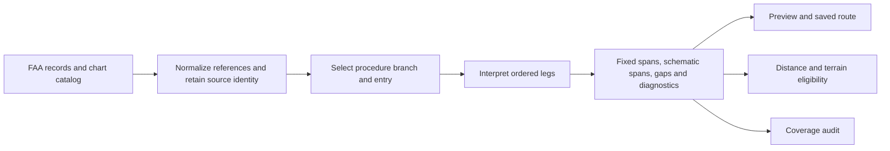

# Approach geometry

Status: implemented locally, 2026-09-20. The ordered interpreter and additive
reference export are in place, with the FAA 2609 navigation bundle rebuilt. The
[coverage guide](approach-coverage.md) records verification, source evidence and
remaining coverage limits. The audit's local rebuild is not evidence of publication.

Represent a procedure as instructions with termination conditions. Preserve their
references during export, interpret them in sequence, and give every drawn span an
explicit quality. Airport identifiers belong in source data and regression fixtures;
the geometry implementation operates on leg types and their constraints.

The target is a useful, connected planning depiction wherever the source supports
one, with a specific explanation wherever it does not. Connection alone does not
establish correctness. A typical climb, turn or intercept remains schematic even
when it joins the next fix successfully.

## One pipeline, three geometry outcomes

Keep responsibilities in the existing boundaries:

| Component | Responsibility |
| --- | --- |
| `faa-regs/lib/approach-routes.ts` | Decode source fields, resolve scoped references, preserve branches, and report missing source data. No drawing assumptions. |
| `packages/contracts/src/approach-routes.ts` | Validate the exported meanings, units, reference identities and data revision. |
| `packages/domain` | Select an entry and interpret its ordered legs using reusable geometry functions and one schematic policy. |
| Route/map/terrain adapters | Consume the shared result. No second interpretation of FAA leg semantics. |
| `tools/audit-iap-coverage.mjs` | Reconcile source coverage and independently check geometry and regressions. |

The domain result contains waypoints, ordered spans, and diagnostics. Each span
retains its source branch/leg IDs and approach/missed phase:

| Outcome | Meaning | Consumers |
| --- | --- | --- |
| `fixed` | Source-constrained map geometry with resolved start, termination and reference; no aircraft-performance or wind assumption. | Map, route distance and terrain, subject to existing consumer eligibility. |
| `schematic` | Representative geometry using identified assumptions such as no wind, climb length or turn radius. | Map and explanatory details; excluded from route distance, terrain and guidance. |
| `gap` | No justified finite connection, with a reason and source location. | Visible discontinuity and explanation; never an implicit direct leg. |

An IF contributes an anchor, not an artificial line. Holds contribute maneuver
depictions and do not advance the route to a different fix. A span may account for
several adjacent source legs, but the interpreter must account for every selected
leg. Revisited fixes remain distinct occurrences in the sequence.

Diagnostics distinguish `missing-reference`, `unsupported-leg`,
`inconsistent-constraints`, `no-forward-intersection`, `manual-termination`, and `geometry-review`. They identify the relevant leg and
missing field or failed constraint. `manual-termination` is an expected open end,
not a renderer defect. A self-crossing can require review without proving that the
published maneuver is wrong.

Policy 2 also recognizes a constrained missed climb/intercept/CF return to a
referenced station. Only the final inbound straight crossing the initial straight
climb is exempted, with explicit turn, station and increasing altitude conditions;
the span remains schematic. Other crossings retain review diagnostics. The
[KIWA case](approach-coverage.md#kiwa-missed-return-and-partial-rendering) records that case and
verifies that unresolved paths still retain known holding fixes and available holds.

Derive the preview summary from this result. The compatibility `incomplete` boolean is now derived from diagnostics. A connected schematic with an unresolved
geometry-review diagnostic must not silently become a verified, complete result.

## Preserve the information that defines a leg

The schema-2 export retains the fields needed by actual leg families. Keep
original values separate from derived geometry; missing values stay missing.

| Information | Why it is needed |
| --- | --- |
| Cycle/export revision, procedure/branch ID and record sequence | Trace every result to the exact source; account for branches the UI cannot yet select. |
| Fix identity, ICAO region/section and airport scope, coordinate and role | Resolve homonyms correctly and distinguish an anchor from a termination fix. |
| Course or heading, true/magnetic reference, turn direction and relevant waypoint descriptors | Preserve the intended direction and fly-over/turn constraints. |
| Referenced navaid/localizer identity, station coordinate and applicable declination/alignment | Construct a referenced course using its own datum. |
| Radial and DME termination fields, distinct VOR/DME antenna positions | Resolve CR/VR and CD/VD/FD; do not substitute a nearby station. |
| Altitude constraint/operator and vertical reference, leg distance/time, arc center/radius | Carry climb instructions and bounded maneuvers without conflating unlike quantities. |

Do not assume that the recommended navaid automatically supplies the datum of every
course on the record. Decode each field according to its leg semantics. Preserve
unresolved references so a consumer can explain the missing information.

Centralize course resolution. Prefer explicitly true courses and source-defined
navaid/localizer references; use airport variation only where appropriate to the
coded course/heading. Do not substitute current WMM variation for a station's
published alignment. The FAA explains both the path/terminator model and the
station-declination distinction in [Instrument Procedures Handbook, chapter 6](https://www.faa.gov/sites/faa.gov/files/regulations_policies/handbooks_manuals/aviation/instrument_procedures_handbook/FAA-H-8083-16B_Chapter_6.pdf).

The Willows case is the first acceptance example: ILA's 18° station declination
must remain distinct from the airport's 14° variation. Recovering the reference is
necessary; the resulting climb/intercept still needs independent geometry checks.

## Interpret legs in sequence

The ordered interpreter replaces pending-climb/intercept pattern matching.
It carries current position, resolved direction, whether that state depends
on an assumption, and the current phase. Dispatch by leg family to pure geometry
functions. A reference fix defines an instruction; it must not teleport the
current position back to that fix after an intervening climb.

| Family | General treatment |
| --- | --- |
| IF; TF/CF/DF | Establish an anchor or resolve the specified termination. A CF must honor its arrival course. A DF from an assumed position remains schematic. Joining two known fixes does not justify an arbitrary turn. |
| RF/AF | Use the specified center, radius and turn; validate the endpoints and sweep. |
| FC | Terminate at the coded distance from its reference fix, then interpret the next leg. Do not make “FC distance + next CF distance” a universal connection rule. |
| CI/VI; CR/VR | Solve a forward intersection with the next defined course or referenced radial. Heading-based geometry carries a no-wind assumption. |
| CD/VD/FD | Resolve the appropriate course/track and station-range termination. Select the forward solution; label any range/height approximation explicitly. |
| CA/VA/FA | Retain the altitude condition and choose a bounded schematic endpoint. Carry that endpoint into the next instruction, including another climb or a return to the same navaid. |
| PI; HA/HF/HM | Draw a representative procedure turn or hold using the coded orientation, side and bounds. Distinguish returning to the inbound course from returning to the start fix. |
| FM/VM and explicit discontinuities | Leave an open end. Do not join across it to a later fix. |
| Unknown or insufficiently specified legs | Emit a reasoned gap and preserve source identity. |

Use a few shared primitives: geodesic advance, line/radial intersection,
line/range intersection, source-defined arc, and bounded turn/join. Lookahead is
limited to the selected branch and the following constraints needed by the current
instruction. It cannot cross an unresolved discontinuity or borrow a target from
another branch or the missed approach to complete the landing path.

Carry assumption provenance forward: a precisely computed intersection from an
assumed climb endpoint is still schematic. At a reached, independently defined
fix, subsequent source-constrained legs can become fixed again. Preserve the
landing endpoint separately from the missed-approach exit.

One versioned schematic policy owns display climb lengths, turn radii, timed
maneuver scale, no-wind assumptions and extent limits. Tune its shared scales
against fixtures rather than adding per-airport values. Altitude fields supply
conditions and labels, not a claim that the
display length is a calculated climb trajectory. Aircraft-performance simulation
is outside this redesign.

Construct the constrained path before rounding a corner. Rounding must retain
the intended turn side, forward motion, endpoint and joining course. An arbitrary
Bezier curve must not conceal a missed intersection. If no bounded representation
satisfies those constraints, emit a gap with its reason.

## Keep availability separate from geometry

The catalog inventory accounts for every chart, including charts with no route.
Record whether a chart has an unambiguous coded association, confirmed FAA exclusion,
unresolved identity, unavailable branch or unsupported chart family. Absence of an
expected identifier alone does not prove FAA omitted the procedure.

Retain conservative title normalization and exact identities. Preserve multiple
main branches and require an explicit association/selection where necessary. Do
not strip Y/Z variants or infer a procedure from runway proximity. An unsupported
branch must appear in the availability ledger, not disappear during export.

The picker needs short actionable messages such as “Missed approach is schematic,”
“Radial reference unavailable,” or “Vectors—path continues with ATC instructions,”
with access to the plate. Keep raw codes and parser details in diagnostics/audits.
Approach versus missed phase remains independent of geometry quality; dashed
missed lines must not become the sole indicator of approximation.

## Implementation and data compatibility

The exporter, contracts, interpreter and route/map adapters share one interpretation
of source fields. Raw-CIFP fixtures check units, signs and region-scoped references.
Preview, attached routes and the audit consume the same result; there is no second
pending-leg resolver. Picker/route messages consume its diagnostics.

Preserve distance/terrain exclusions, straight-leg HSI eligibility and direct-to
restrictions; a displayed schematic must never become ordinary waypoint legs.
Coordinate client support with publisher revisions, preserve pinned offline editions,
and use explicit Verify/update. Old exports remain usable without inventing fields
they did not retain.

Index procedures and referenced stations once per immutable data revision. Walk a
selected branch in order and bound lookahead/sampling; do not run a search over
all fixes for each leg. Reuse the selected-entry result across consumers, and bound
any cache by data revision, entry and schematic-policy version. No new service,
airport patch table or general-purpose constraint framework is needed.

Publisher artifacts and manifests must remain consistent across same-cycle
rebuilds; see [navigation rebuilds](chart-feed.md#navigation-rebuilds-within-a-cycle).
Old exports remain usable with explicit missing-reference diagnostics. Loading a
new app alone cannot recover fields absent from a saved data edition.

## Acceptance cases and release evidence

The pre-redesign California baseline had 597 nonvisual chart records at 168 airports, 439 matched
charts, 1,648 entries, 87 incomplete entries and two geometrically suspect entries
marked complete. The [coverage guide](approach-coverage.md) records the later fixes.
Counts overlap between leg families. Track availability, intentional
open ends, unresolved defects and schematic geometry independently.

| Finding | Required evidence |
| --- | --- |
| KWLW VOR 34 | Retained ILA reference and correct datum; plate-consistent course/turn; suspect crossing corrected or explicitly unresolved. A passing completeness flag is insufficient. |
| KLAX 25L/25R and KTOA 29R | Correct radial crossing followed by the next heading/intercept, with no dropped or direct-to substituted leg. |
| KVNY ILS Z 16R | Terminate the initial missed segment at the referenced VNY DME condition before the following maneuver. |
| KCMA VOR 26 and KCEC VOR/DME 12 | Ordered climb sequence and nonzero departure/return maneuver at the same navaid, with schematic provenance throughout. |
| PI examples at KAPC, KAVX and KPOC | Correct outbound side and inbound return within supported bounds; no invented operational timing or exact flight track. |
| KRDD ILS/LOC 35 from RBL | Explain 7.9 NM FC / 2.0 NM CF coding against the 7.9 NM surveyed/charted feeder. Accept only a source-supported interpretation; otherwise retain an explicit inconsistency. |
| O69, KAPC REBAS, KSTS, KMCE, KLGB RNP and KSNS arcs | Preserve the established entry choices, fixed arcs, MAP/exit roles, course connections and distance/terrain treatment. |
| Every unavailable chart | A retained inventory record and a specific source/identity/coverage reason, including multiple main branches. |

Use raw-CIFP-to-export fixtures and independent endpoint/course/turn assertions.
The audit consumes interpreter diagnostics for causes, but keeps independent source
reconciliation and geometric checks so it cannot merely certify its own output.
Check finite coordinates, forward intersections, referenced ranges/radials, coded
turn side, branch/phase boundaries and expected landing/missed endpoints. Screen
crossings and implausible extents with maneuver-aware exceptions; holds and genuine
return paths cannot be treated as ordinary direct segments.

Every cycle must account for all charts, branches and selected legs, with zero
unclassified omissions. Review new or changed failures against plates; retain
source/renderer/policy versions with the report. Broad connectivity is a coverage
measure, not a claim of operational completeness or certified flight guidance.
